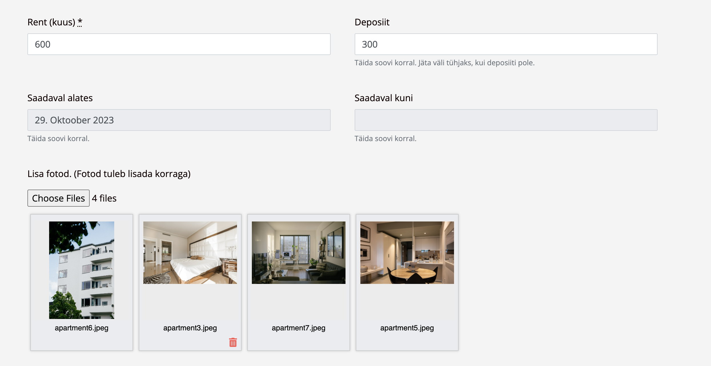

## Website for Co-Flat, apartment-sharing website 

Solo coded a platform for apartment rentals in Tallinn on Ruby on Rails. Integrated authentication, online payments with Stripe, implemented a relational database with bookings, different types of users, etc. Image uploading with Cloudinary, implemented address search with Algolia API. Mobile responsive design created with Bootstrap library. Learned to work with Heroku server, Github and had fun working on a project!✨💻

Have a look:
[Website hosted on Heroku](https://coflat20-595fdbc6e546.herokuapp.com/)

### Overview of the functionalities & views

**Search for apartments using filters and by looking through the locations on the interactive map**

About the development:
- Interactive map integration using OpenStreetMap which parses the address of the rental unit and assigns it a geographic location
- Bootstrap carousel component for interactively browsing multiple photos of a rental unit

**Post a listing for an apartment**

After creating an account, the user is able to post listings for the apartment. The address typed in will be translated to latitude and longitude by OpenStreetMap automatically. They are then able to specify the details about the listing, such as the number of bedrooms, washrooms, rent, description, check for all the amenities available, etc.

Additionally, the user has a special integration for choosing dates from the calendar and when uploading pictures, they are able to delete and reorder them. The functionality uses Cloudinary API to save photos efficiently and remember the order for each listing.

### Inspiration for the project

The rental market in Estonia is especially difficult to navigate for college students. Many of them choose to rent apartments together to pay lower rent and look for flatmates on Facebook groups. I wished to build a website where people can post listings about which flatmates they prefer and connect with each other. When posting the listing they have options to specify if they are looking for 1, 2, ... flatmates, if they are most comfortable with some particular gender, etc. Unfortunately, it was difficult to market the website to the college students to have people make use of it but I learned how to create a complete full-stack application with user management and API integrations.

### Deployment on Heroku

The application was deployed in Heroku 20 stack. To redeploy the new versions run:

`git push heroku-20`

`heroku run db:migrate` to run the migrations on Heroku
