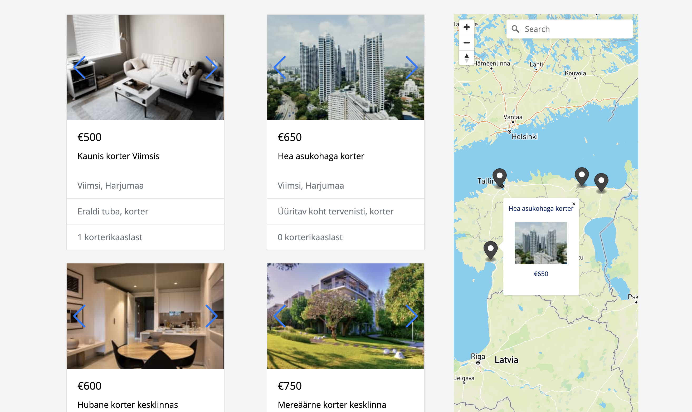

## Website for Co-Flat, apartment-sharing website 

Solo coded a platform for apartment rentals in Tallinn on Ruby on Rails. Integrated authentication, online payments with Stripe, implemented a relational database with bookings, different types of users, etc. Image uploading with Cloudinary, implemented address search with Algolia API. Mobile responsive design created with Bootstrap library. Learned to work with Heroku server, Github and had fun working on a project!✨💻

Have a look:
[Website hosted on Heroku](https://coflat20-595fdbc6e546.herokuapp.com/)

### Overview of the functionalities & views

Search for apartments using filters and by looking through the locations on the interactive map

About the development:
- Interactive map integration using OpenStreetMap which parses the address of the rental unit and assigns it a geographic location
- Bootstrap carousel component for interactively browsing multiple photos of a rental unit

### Deployment on Heroku

The application was deployed in Heroku 20 stack. To redeploy the new versions run:

`git push heroku-20`

`heroku run db:migrate` to run the migrations on Heroku
